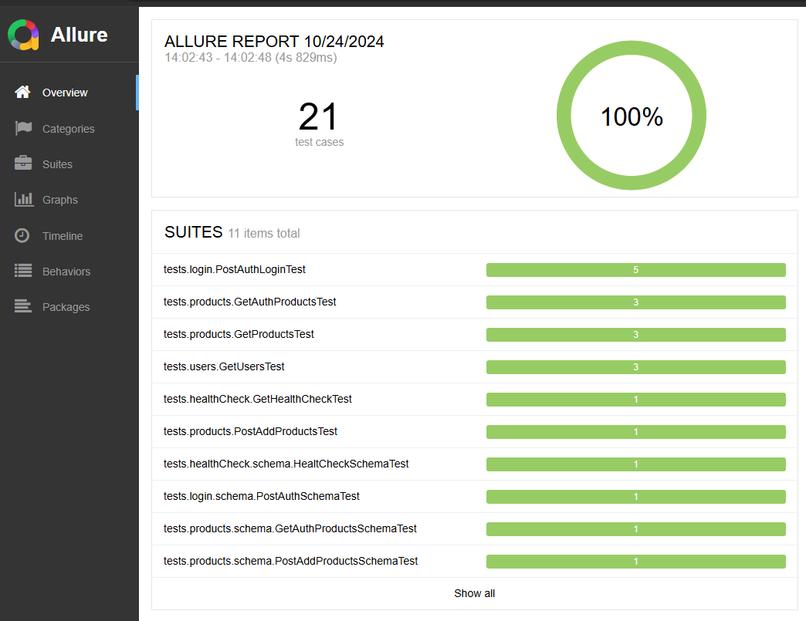

# restAssured API Testing Automation

Desafio Técnico utilizando `restAssured`, `Java` and `JUnit4` p/ automatizar serviços básicos de uma API.

## 🚀 Descrição:

Projeto base, que consiste em demonstrar uma estrutura simples e escalável para os testes de APIs.

## 📁 Estrutura do Projeto
- java
  - --data [**Diretório que contém a classe data factory**]
  - --model [**Diretório que contém a classe modelo da request/response para utilizar na Serilalização do Obj JSON**]
- test
  -   -- java
      -   -- core [ **Classe com config default do restAssured / Interface com constants que são utilizadas no projeto**]
      -   -- runners [**Runner do JUnit4 p/ Execução dos testes com categorias: Contract e Regression**]
      -   -- suite
      -   -- tests [Estrutura que contém as classes de testes criadas no projeto]
          - Ex: Nome do Serviço ( Login )
            - schema [**Diretório que contém os testes de contrato via JSOn Schem**]
            - util [**Diretório utilizada para organizar classes e métodos comuns a mais de um cenário**]
      -   -- resources [**Diretório que contém os arquivos .json divididos por estrutura de pasta ref. ao seu domínio**]

## 🚀 Pré-requisitos:

- [JAVA](https://www.oracle.com/java/technologies/javase/jdk17-archive-downloads.html)
- [MAVEN](https://maven.apache.org/)

## 🔧 Instalação:

- Clonar o Projeto ` git clone https://gitlab.com/leindecker/sicredi-api.git`
- Abrir o projeto no IntelliJ

## ⚙️ Executando os testes via maven:

```commandline
mvn test
```
## 🔩 Executando os testes via Junit/IntelliJ:

Após importar o projeto com sucesso no IntelliJ, clique para expandir o Source Folder: `src/test/java/runner`, clique com o botão direito do mouse sobre a suite de testes desejada >> Run .

## 🚀 Execução do Checkstyle via Maven:

```commandline
mvn validate
```
## 🚀 Relatório:
- O relatório é gerado na pasta `allure-results`

Abrir o terminal e digitar:
`allure serve allure-results`


Para Visualizar o relatório gerado através do Pipeline do GitLab
- Acessar Build -> Pipelines
- Clicar na primeira execução da fila
- Acessar o Job `report`
- Na lateral direita clicar em Browse na sessão de Job artifacts
- Então você deve abrir o arquivo `index.html`

## 📋 Planos de Testes:

- GET /test
  - Health Check da API
- GET /users
   - Buscar todos usuários
   - Buscar usuário por ID
   - Buscar usuário com ID inválido
- POST /auth/login
   - Autenticar usando credenciais corretas
   - Autenticar usando credenciais incorretas
   - Autenticar sem passar username e password
   - Autenticar sem passar password
   - Autenticar sem passar username
- GET /auth/products
   - Buscar todos os produtos com token de autenticação correto
   - Buscar todos os produtos sem token de autenticação
   - Buscar todos os produtos com token de autenticação expirado
- POST /products/add
  - Adicionar produto com sucesso
- GET /products
  - Buscar todos os produtos
- GET /products/{id}
   - Buscar produto por ID
   - Buscar produto por ID inválido

## 🐛 - Abertura de Bugs 
Caso seja encontrado algum possível BUG é necessário seguir o template abaixo para registro e análise do mesmo.
- Título e breve descrição
- Ambiente afetado
- Usuário/Massa de dados utilizada
- Passos para reprodução
- cURL
